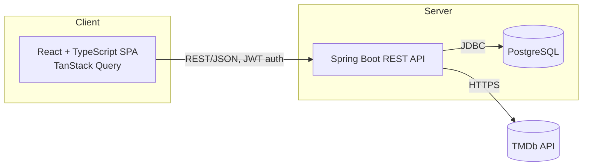
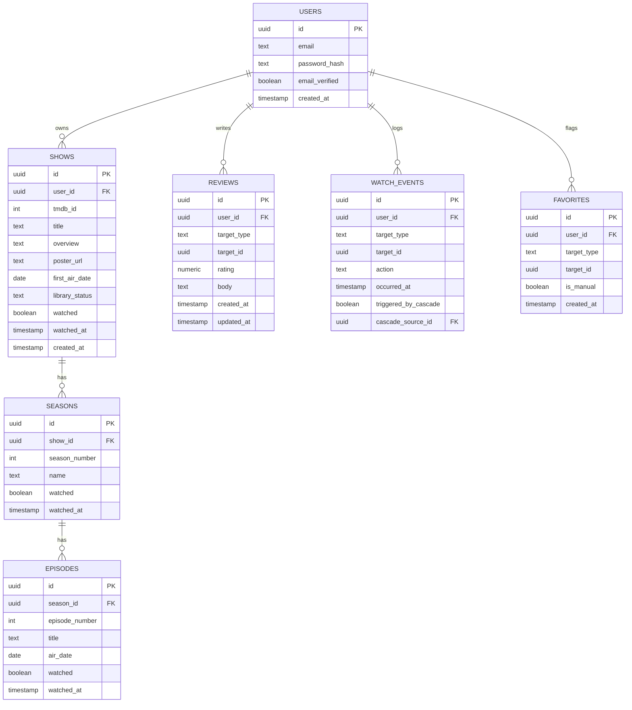
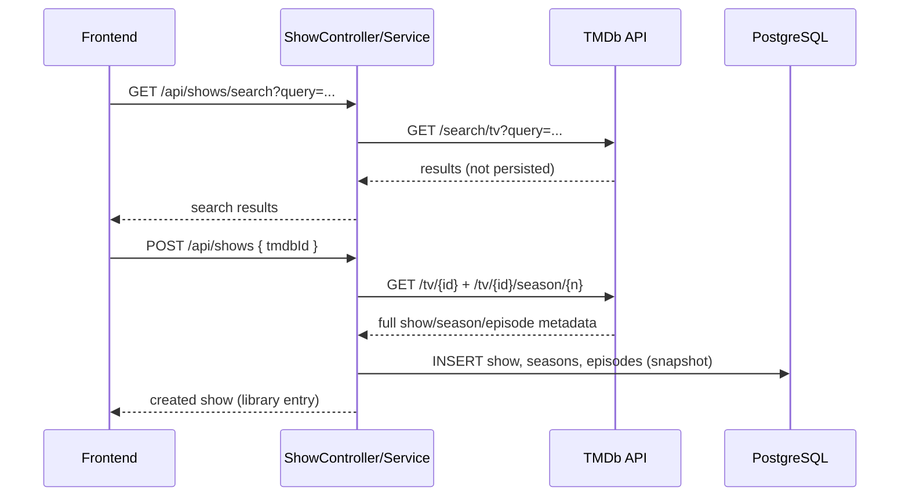
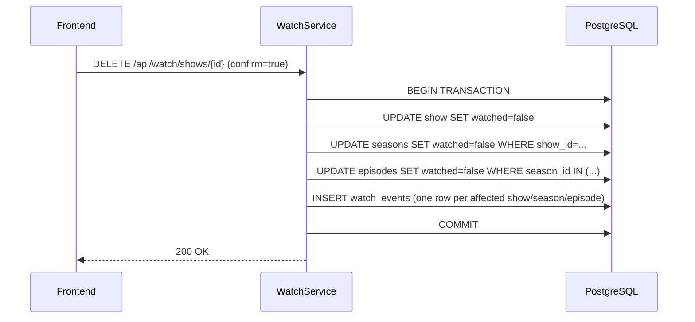

# Architecture Document: TV Show Tracker

Companion to `PRD.md`. This document describes how the system is structured to deliver those requirements.

---

## 1. System Overview

A classic client-server architecture: a React SPA talks to a Spring Boot REST API over HTTPS/JSON, backed by PostgreSQL. The backend also talks out to TMDb for show discovery/metadata. No other external services are involved for MVP.



- **Frontend** never talks to TMDb directly — all metadata fetches are proxied through the backend, which owns the caching/snapshotting behavior.
- **Backend** is a single Spring Boot application (no separate microservices) — appropriate given the scope and the "local/dev only for now" deployment target.

---

## 2. Backend Architecture

### 2.1 Package Structure — Feature-Based

Each domain feature owns its full vertical slice (controller → service → repository → entity/dto). Cross-cutting concerns live in `common/` and `config/`.

```
backend/
└── src/main/java/com/tvtracker/
    ├── auth/
    │   ├── AuthController.java
    │   ├── AuthService.java
    │   ├── EmailVerificationTokenRepository.java
    │   ├── PasswordResetTokenRepository.java
    │   ├── UserRepository.java
    │   ├── User.java                  (entity)
    │   └── dto/
    │       ├── RegisterRequest.java
    │       ├── LoginRequest.java
    │       └── AuthResponse.java
    │
    ├── show/
    │   ├── ShowController.java        (search + library CRUD)
    │   ├── ShowService.java
    │   ├── ShowRepository.java
    │   ├── SeasonRepository.java
    │   ├── EpisodeRepository.java
    │   ├── Show.java / Season.java / Episode.java   (entities)
    │   ├── tmdb/
    │   │   ├── TmdbClient.java         (HTTP client to TMDb)
    │   │   └── TmdbMapper.java         (TMDb DTOs -> local entities)
    │   └── dto/
    │
    ├── watch/
    │   ├── WatchController.java
    │   ├── WatchService.java           (owns cascade logic)
    │   ├── WatchEventRepository.java
    │   ├── WatchEvent.java             (entity — immutable log)
    │   └── dto/
    │
    ├── review/
    │   ├── ReviewController.java
    │   ├── ReviewService.java
    │   ├── ReviewRepository.java
    │   ├── Review.java
    │   └── dto/
    │
    ├── favorite/
    │   ├── FavoriteController.java
    │   ├── FavoriteService.java
    │   ├── FavoriteRepository.java
    │   ├── Favorite.java
    │   └── dto/
    │
    ├── analytics/
    │   ├── AnalyticsController.java
    │   ├── AnalyticsService.java       (reads across watch/review/favorite)
    │   └── dto/
    │
    ├── common/
    │   ├── TargetType.java             (shared enum: EPISODE/SEASON/SHOW)
    │   ├── exception/                  (ApiException, GlobalExceptionHandler)
    │   └── security/
    │       ├── JwtTokenProvider.java
    │       ├── SecurityConfig.java
    │       └── CurrentUserResolver.java
    │
    └── config/
        ├── OpenApiConfig.java          (Swagger/OpenAPI setup)
        └── TmdbConfig.java             (API key, base URL, rate-limit settings)
```

- `analytics/` is intentionally read-only and cross-cutting — it queries `watch_events`, `reviews`, and `favorites` directly rather than owning its own tables.
- `watch/` owns all cascade logic (Section 5) so that mark/unmark rules live in exactly one place.

### 2.2 API Documentation
OpenAPI/Swagger is auto-generated via `springdoc-openapi`, exposing:
- `/v3/api-docs` — raw OpenAPI JSON
- `/swagger-ui.html` — interactive docs UI

Every controller endpoint is annotated (`@Operation`, `@ApiResponse`) so the generated docs stay accurate without a hand-maintained spec.

---

## 3. Database Schema



### 3.1 Notes on Types & Constraints
- `library_status` on `shows`: `'NONE' | 'PLAN_TO_WATCH'` (enforced via check constraint or Postgres enum type).
- `target_type` (on `reviews`, `watch_events`, `favorites`): `'EPISODE' | 'SEASON' | 'SHOW'` (favorites additionally restricted to `'SEASON' | 'SHOW'` at the application layer).
- `rating` on `reviews`: `NUMERIC(2,1)`, application-validated to `{0.5, 1.0, 1.5, ..., 5.0}`.
- `watch_events.action`: `'WATCHED' | 'UNWATCHED'`.
- `watch_events` is **append-only** — no `UPDATE`/`DELETE` operations are exposed by the repository layer for this table.
- Unique constraints: `reviews(user_id, target_type, target_id)`, `favorites(user_id, target_type, target_id)` — one review and one favorite-flag per user per target.
- Indexes: `shows(user_id)`, `seasons(show_id)`, `episodes(season_id)`, `watch_events(user_id, target_type, target_id)`, `watch_events(user_id, occurred_at)` (for period-based analytics queries).
- All tables except `users` are implicitly scoped by `user_id` (directly or via parent `show_id`/`season_id`), enforced in the repository/service layer on every query — never trusted from client input alone.

---

## 4. TMDb Integration & Snapshotting



- Search results are never persisted — only a full "add to library" action triggers a snapshot write.
- The snapshot is a one-time copy; TMDb is not polled afterward for changes (per PRD assumption #2 — flagged for confirmation).
- `TmdbClient` is the only component allowed to call out to TMDb; it wraps the API key and handles rate-limit backoff/retry.

---

## 5. Watch Cascade Logic

Owned entirely by `WatchService`. Two operations, both wrapped in a single DB transaction:

**Mark watched (episode/season/show):**
1. Set `watched = true`, `watched_at = now()` on the target.
2. If target is a season or show, recursively apply the same to all children, using the *same* timestamp.
3. Write one `watch_events` row per affected row (`action = WATCHED`), marking child rows as `triggered_by_cascade = true` with `cascade_source_id` pointing to the top-level event.

**Unmark watched (episode/season/show):**
1. Frontend must send an explicit confirmation flag for season/show-level unmark requests (backend rejects without it — see 8.1).
2. Set `watched = false` on the target and, for season/show, all descendants.
3. Write corresponding `watch_events` rows (`action = UNWATCHED`) for every affected row, same cascade-tagging rule as above.



The entire cascade is one atomic transaction (per PRD §8.3) — a partial cascade is never left in the database.

---

## 6. Analytics Computation

`AnalyticsService` runs read-only aggregate queries against `watch_events` (and joins to `reviews`/`favorites` where relevant). No separate analytics tables/materialized views for MVP — computed on read, since data volume per user is small.

Representative queries:
- **Watch counts by period:** `COUNT(*) FROM watch_events WHERE user_id = ? AND action = 'WATCHED' AND occurred_at BETWEEN ? AND ? GROUP BY target_type`
- **Longest time to watch a show:** for each show, `MAX(occurred_at) - MIN(occurred_at)` over `watch_events` where `target_type = 'EPISODE' AND action = 'WATCHED'`, grouped by the episode's parent show.
- **Favorites:** `AVG(rating) FROM reviews WHERE target_type IN ('SHOW','SEASON') GROUP BY target_id`, unioned with manually-flagged rows from `favorites`.

---

## 7. Frontend Architecture

### 7.1 Folder Structure

```
frontend/
└── src/
    ├── api/                  # typed API client functions, one file per backend feature
    │   ├── authApi.ts
    │   ├── showApi.ts
    │   ├── watchApi.ts
    │   ├── reviewApi.ts
    │   ├── favoriteApi.ts
    │   └── analyticsApi.ts
    │
    ├── features/              # feature-oriented UI, mirrors backend features
    │   ├── auth/               (pages, hooks/, authKeys.ts, clearSession.ts)
    │   │   └── hooks/           (useQuery/useMutation per authApi function)
    │   ├── library/             (search, add show, library list/detail)
    │   │   └── hooks/
    │   ├── watch/               (mark/unmark controls, confirmation modal)
    │   │   └── hooks/
    │   ├── reviews/             (review form, review list)
    │   │   └── hooks/
    │   ├── favorites/
    │   │   └── hooks/
    │   └── analytics/           (dashboards/charts)
    │       └── hooks/
    │
    ├── hooks/                  # shared facades only (useAuth composes auth TanStack hooks)
    ├── components/              # shared/dumb UI components (buttons, stars, modals)
    ├── routes/                  # route definitions
    └── lib/
        └── queryClient.ts        # TanStack Query client config
```

### 7.2 Server State — TanStack Query
- Every `api/*.ts` function is wrapped in a `useQuery`/`useMutation` hook within its feature folder (e.g. `useShowLibrary()`, `useMarkWatched()`).
- Query keys are namespaced by feature and target, e.g. `['shows', userId]`, `['watch-status', targetType, targetId]`, `['analytics', 'watch-counts', period]`.
- Mutations (mark/unmark watched, add review, toggle favorite) invalidate the relevant query keys on success — e.g. marking a show watched invalidates that show's detail query *and* all descendant season/episode queries *and* the analytics queries, since cascades affect all of them.
- Local component/UI-only state (form inputs, modal open/closed) uses plain `useState`, not TanStack Query.

### 7.2.1 Auth and session

- JWT in `localStorage` via `api/client.ts` is client session plumbing (not TanStack-managed).
- `/api/me` and all other API responses use TanStack Query only.
- `hooks/useAuth` is a shared **facade** composing TanStack hooks; it must not fetch directly.
- Reference implementation: `features/auth/hooks/`, `authKeys.ts`, `clearSession.ts`.

**Deprecated patterns (superseded by `frontend-tanstack-auth`; do not reintroduce):**

| Dead pattern | Replacement |
|---|---|
| `AuthProvider` / React Context for user state | `QueryClientProvider` + `useCurrentUser()` |
| `refreshUser()` | `queryClient.invalidateQueries({ queryKey: authKeys.me() })` |
| `useState`/`useEffect` + `authApi.getCurrentUser()` | `useCurrentUser()` |
| Direct `authApi.*` in pages | `features/auth/hooks/use*.ts` |
| `getErrorMessage` exported from `useAuth.tsx` | `lib/getErrorMessage.ts` |

### 7.3 Cascade Confirmation UX
Unmarking a season/show as watched triggers a confirmation modal (shared `useConfirm` hook) before the mutation fires — matching the backend's requirement for an explicit confirm flag (Section 5).

---

## 8. Cross-Cutting Concerns

### 8.1 Security
- JWT issued on login/register, sent as `Authorization: Bearer <token>` on every request.
- `CurrentUserResolver` injects the authenticated user's ID into every service call — repositories always filter by this ID; no endpoint accepts a client-supplied user ID.
- Season/show-level unmark endpoints require a `confirm=true` request parameter; requests without it return `400` with a message directing the client to confirm.

### 8.2 Error Handling
- `GlobalExceptionHandler` (`@ControllerAdvice`) maps domain exceptions (`NotFoundException`, `ValidationException`, `ForbiddenException`) to consistent JSON error responses with appropriate HTTP status codes.

### 8.3 Testing Strategy
- **Backend:** JUnit 5 + Mockito for service-layer unit tests (especially `WatchService` cascade logic and `AnalyticsService` calculations); `@SpringBootTest` + Testcontainers (Postgres) for controller/repository integration tests.
- **Frontend:** Vitest + React Testing Library for component/hook unit tests; integration tests for key flows (search → add show, mark watched → cascade UI update, write review) using mocked API responses.
- Each feature package/folder (backend and frontend alike) owns its own tests colocated alongside the code they test.

### 8.4 Local Development Setup
- `docker-compose.yml` at the repo root spins up PostgreSQL for local development only (app processes themselves run natively via Gradle/pnpm, not containerized yet — per PRD §7.4).
- Backend configuration via Spring profiles (`application-local.yml`) for DB connection, TMDb API key, and JWT secret.
- Frontend configuration via `.env.local` for the API base URL.

---

## 9. Open Items Carried Over from PRD

The three assumptions flagged in `PRD.md` §9 directly affect this architecture (schema for `library_status`, the snapshot-vs-live-sync model in Section 4, and cascade-delete behavior) — if those change, the schema and TMDb integration section will need revisiting accordingly.